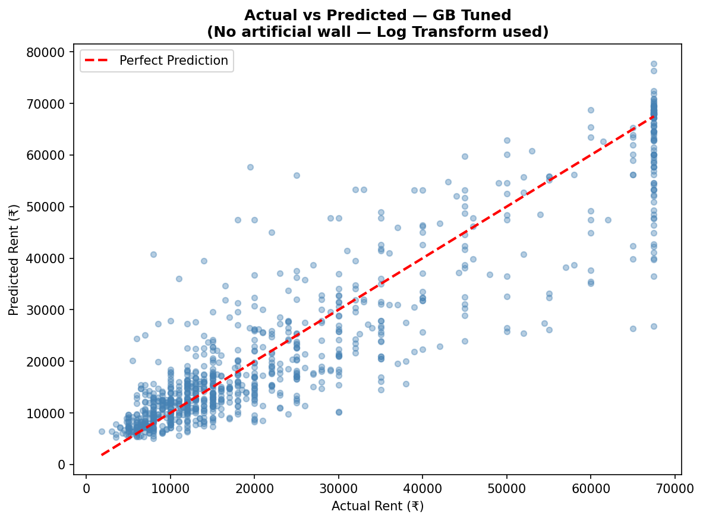
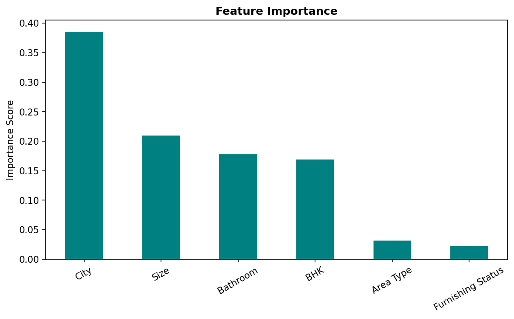

#  House Rent Prediction  : ML Project
 
> Predicting house rent prices across major Indian cities using an end-to-end Machine Learning pipeline.
 
---
 
##  Project Overview
 
This project builds a complete ML regression pipeline to predict monthly house rent based on property features such as size, location, furnishing status, and number of rooms.
 
The pipeline covers everything from raw data loading to model evaluation — following industry-standard practices used in real data science teams.
 
---
 
##  Dataset
 
| Property | Detail |
|----------|--------|
| Source | House Rent Dataset |
| Rows | 4,746 |
| Features | 12 columns |
| Target | Rent (₹/month) |
| Cities | Mumbai, Delhi, Bangalore, Chennai, Kolkata, Hyderabad |
 
---
##  ML Pipeline 
 
| Step | Description |
|------|-------------|
| 1 | Import Libraries |
| 2 | Load Dataset |
| 3 | Exploratory Data Analysis (EDA) |
| 4 | Data Preprocessing |
| 5 | Correlation Analysis |
| 6 | Feature & Target Definition |
| 7 | Train / Test Split (80/20) |
| 8 | Feature Scaling (RobustScaler) |
| 9 | Model Training & Evaluation |
| 10 | XGBoost |
| 11 | Hyperparameter Tuning (GridSearchCV) |
| 12 | Model Comparison |
| 13 | Actual vs Predicted Plot |
| 14 | Feature Importance |
| 15 | Cross Validation |
| 16 | Final Prediction |
 
---
 
## 🤖 Models Trained
 
- Linear Regression
- Decision Tree Regressor
- Random Forest Regressor
- Gradient Boosting Regressor
- XGBoost Regressor
- Gradient Boosting — Hyperparameter Tuned  **(Best)**
 
---
 
##  Results
 
| Model | R² Score | MAE (₹) |
|-------|----------|---------|
| **GB Tuned** ✅ | **0.8361** | **₹5,357** |
| Gradient Boosting | 0.8313 | ₹5,520 |
| Random Forest | 0.8163 | ₹5,890 |
| Decision Tree | 0.7348 | ₹7,200 |
| Linear Regression | 0.3393 | ₹14,800 |
 
### Actual vs Predicted — Best Model


### Feature Importance


---
 | Library | Use |
|---------|-----|
| Pandas | Data loading & manipulation |
| NumPy | Numerical operations |
| Matplotlib / Seaborn | Visualizations |
| Scikit-learn | ML models & preprocessing |
| XGBoost | Advanced boosting model |
 
---
 
##  Sample Prediction
 
```
Input Details:
   BHK                  : 2
   Size                 : 1000
   Area Type            : Super Area
   City                 : Bangalore
   Furnishing Status    : Semi-Furnished
   Bathroom             : 2

    Predicted Rent : 14,759 / month
```
 
---
 
### Author    :  **Saman Tarique**


##  Note
This project is built for learning and portfolio purposes and demonstrates an end-to-end machine learning regression pipeline.
